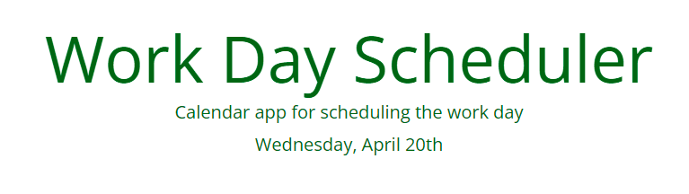
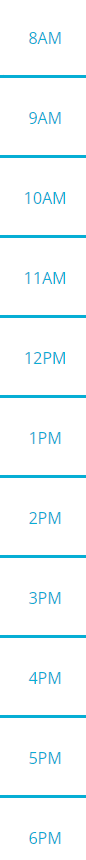
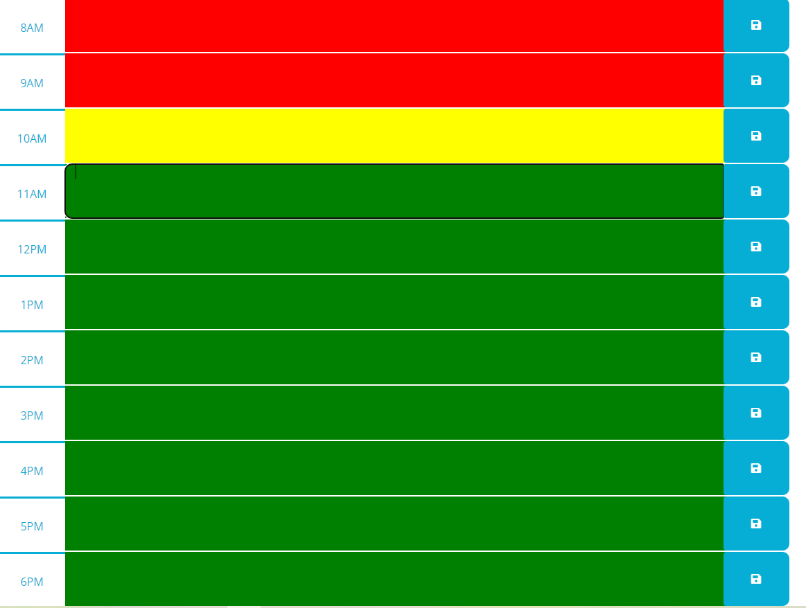
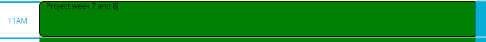
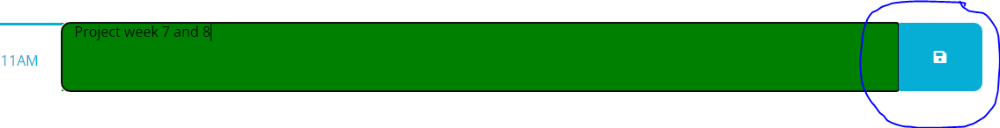
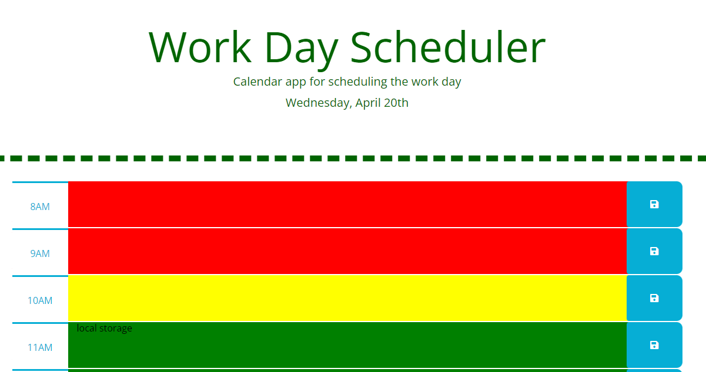

# Week-5-homework
This is a simple calendar application that allows a user to save events for each hour of the day by modifying starter code. This app will run in the browser and feature dynamically updated HTML and CSS powered by jQuery.

The current day is displayed at the top of the calendar;
 

timeblocks are set for standard business hours;
  

each timeblock is color coded to indicate whether it is in the past (red), present(yellow), or future(green);
 

it is possible to enter an event;
  

the text for that event is saved in local storage clicking the save button;
  

even if you refresh the page, the saved events persist.
 
 

This is the URL of the deployed application: https://mattesanna017.github.io/Week-5-homework/

© 2022 Matteo Sanna. Confidential and Proprietary. All Rights Reserved.